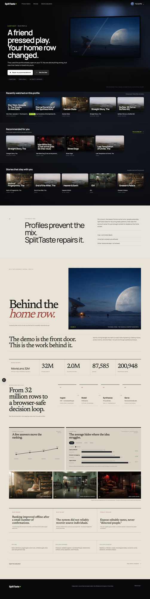
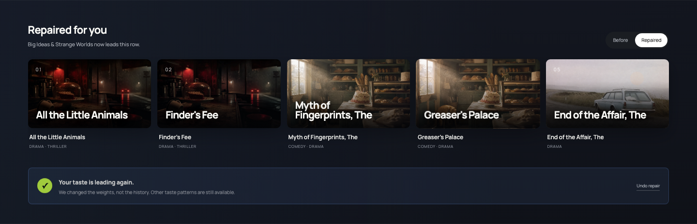
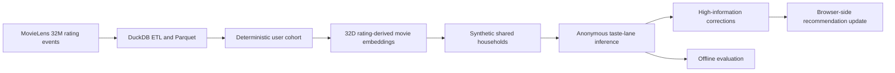

# SplitTaste

**Shared accounts are not confused profiles. They are mixtures with the wrong weights.**

SplitTaste is an independent, noncommercial research demo about a familiar streaming problem: a friend or family member presses play on your profile, and their choices begin reshaping your home screen. Instead of demanding perfect profile switching, SplitTaste finds anonymous taste patterns, asks two plain-language questions, and reweights recommendations immediately.

No identity is inferred. No demographic or account-sharing claim is made.



## Review it in two passes

This repository is intentionally organized for a Prime Video hiring manager:

1. **Product demo — about 30 seconds.** Experience the household problem, answer two questions, and watch the recommendation row repair itself in place.
2. **Data & evaluation — about 2 minutes.** Inspect the 32M-row source, reproducible pipeline, correction curve, cohort EDA, failure cases, and role-specific engineering evidence.

The product is the decision loop. The analysis underneath shows whether that loop deserves to exist.

## The 30-second demo

1. Start with the real-life moment: a friend watched on your TV without switching profiles.
2. See why the account remembers the titles but not the social context.
3. Choose which of three anonymous taste patterns feels most like yours.
4. Answer whether one high-information title was your choice, probably a guest's, or uncertain.
5. Compare the blended row with your repaired row, then scroll to **Data & evaluation** for the offline test and its boundaries.

The interface uses titles, genres, and tags only. It does not use movie posters or external metadata calls.

The titles shown in the rails are real MovieLens catalog titles. Their imagery is a lightweight set of original illustrative stills generated specifically for this noncommercial demo; it is not official poster or production artwork and is intentionally reused by genre.



## Measured result

On 72 deterministic synthetic households spanning sizes 2–4, overlap strata, activity, and sparsity cohorts:

| Offline metric | Blended account | SplitTaste after 3 confirmations | Oracle bound |
|---|---:|---:|---:|
| NDCG@10 | 0.0292 | **0.0406** | 0.0717 |
| Recall@10 | 0.0138 | **0.0189** | — |

The bootstrap 95% confidence interval for the post-correction NDCG@10 delta versus blended was **+0.0001 to +0.0226**, so the narrow offline ranking claim passed its predefined gate.

Corrections improved average NDCG@10 from 0.0387 at zero confirmations to 0.0406, 0.0420, and 0.0447 after 3, 5, and 10 confirmations.

The more important limitation is persona recovery: ARI was 0.0677 and automatic lane-count accuracy was 31.9%. The system improved ranking without reliably recovering source individuals. That is why the product exposes editable **taste lanes**, not detected people.

The on-page cohort explorer is part of the EDA, not decoration. It breaks results down by taste overlap, household size, activity, and sparsity. For example, the middle-activity cohort declined from 0.0336 to 0.0292 NDCG@10, while the higher- and lower-activity cohorts improved. That failure case is shown because averages alone are not enough for a product decision.

## Why this exists

A shared account can contain several internally coherent preferences. Averaging them together may create recommendation interference: everyone influences everything, and nobody gets a clean signal. Profiles can prevent the problem, but only when people remember to switch before pressing play. SplitTaste explores a recovery loop for the moments when they do not.

SplitTaste tests a narrower hypothesis:

> Can a small number of user-controlled corrections reduce offline recommendation interference in deterministic synthetic households?

It does not test real viewing, engagement, retention, or production performance.

## Quick start

```bash
npm install
npm run dev
```

The committed demo bundle is small and runs entirely in the browser. No API key, database, or raw MovieLens download is needed to view it.

To reproduce the research pipeline:

```bash
uv sync --dev
uv run python -m pipeline.download
uv run python -m pipeline.build
uv run python -m pipeline.evaluate
```

The full dataset is approximately 228 MB compressed. Raw and evaluator-only data remain gitignored.

## How it works



- **Data layer:** DuckDB normalizes the official CSV files to compressed Parquet.
- **Model layer:** Truncated SVD learns 32-dimensional movie representations from a deterministic user cohort. Synthetic households combine 2–4 real anonymized rating histories.
- **Interaction layer:** the user voluntarily labels their own taste pattern; uncertainty and estimated ranking impact determine which title is worth asking about next. “Guest” is never inferred by the model.
- **Product layer:** the public `DemoBundle` contains no MovieLens user IDs or evaluator ground truth. Recommendation recalculation is local and deterministic.

## Visual system

The product layer uses a restrained streaming-service interface with Manrope. The research layer switches into a film-journal treatment with Newsreader, warm paper tones, archival rules, large tally figures, and image-led transitions. The direction draws from MUBI Notebook's editorial cinema framing, Sight & Sound's poll archive, Letterboxd's image-rich annual statistics, and Criterion Current's spacious magazine layouts without reproducing any of their branding or copyrighted artwork.

Six original 16:9 stills live under `public/images/film-stills/`. They are mapped deterministically by genre so every MovieLens title card has an image while the site makes no external poster requests.

## Evaluation contract

Every source user is split chronologically at the rating-event grain. The last 20% of rating events is held out. A rating event is not treated as a confirmed watch or a watch session.

The evaluation compares:

- one blended shared-account profile;
- inferred SplitTaste lanes after 0, 3, 5, and 10 confirmations;
- an evaluator-only oracle using the known synthetic mapping.

Reported metrics include ARI, NMI, lane-count accuracy, held-out assignment accuracy, NDCG@10, Recall@10, negative transfer, correction curves, and abstention precision/coverage. A positive improvement claim is allowed only when the bootstrap 95% confidence interval for the post-correction NDCG delta is above zero.

See [Methodology](docs/METHODOLOGY.md) for exact grain, cohort, denominator, and claim rules. Measured output is stored in [`artifacts/evaluation.json`](artifacts/evaluation.json) after the full run.

## Data provenance and license

MovieLens 32M contains 32,000,204 ratings and 2,000,072 tag applications across 87,585 movies from 200,948 anonymized users. It contains no demographics or household field.

- Source: [GroupLens MovieLens 32M](https://files.grouplens.org/datasets/movielens/)
- Dataset terms: research use, attribution, same-condition redistribution, and no commercial or revenue-bearing use without GroupLens permission
- Raw data: downloaded by the user, checksum-validated, and never committed
- Public bundle: a small transformed research artifact distributed with the same dataset conditions

See [Data and license notes](DATA_LICENSE.md) before reusing or deploying this project.

## Repository guide

- `app/`, `components/`, `lib/`: static Next.js experience and browser-side scoring
- `pipeline/`: acquisition, ETL, household construction, modeling, and evaluation
- `tests/`: hand-calculated metric and model-behavior checks
- `public/data/demo-bundle.json`: versioned public product contract
- `artifacts/evaluation.json`: aggregate offline results, never source-user mappings

## What this demonstrates

1. End-to-end behavioral-data ETL, modeling, reproducible evaluation, and honest metric definitions.
2. Translation of personalization program metrics into a user-facing decision loop.

Those are product and analytics capabilities, not claims about any employer's internal systems.

## Limitations

- Synthetic households are not real MovieLens households.
- Rating events do not establish who watched a title or when it was viewed.
- Taste lanes capture patterns, not stable people or identities.
- The embedding cohort is a deterministic sample of eligible MovieLens users, not the full population.
- Ranking improved offline, but source-person and lane-count recovery remained weak.
- Offline ranking quality does not establish business or engagement lift.
- The browser demo uses one representative three-lane account; the evaluation covers multiple household sizes and overlap strata.

## Status

Portfolio MVP. Local validation is not production readiness, deployment, or real-user validation. This project is independent and is not affiliated with or endorsed by Amazon, Prime Video, the University of Minnesota, or GroupLens.
